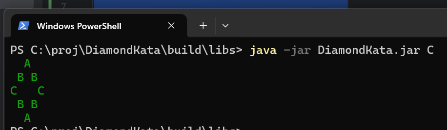
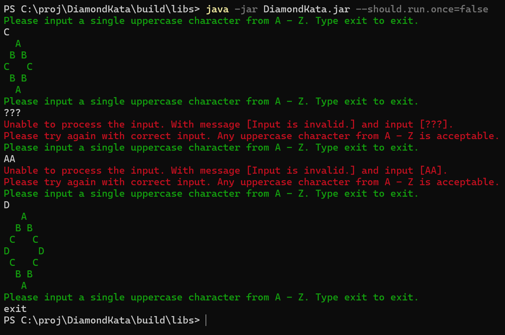
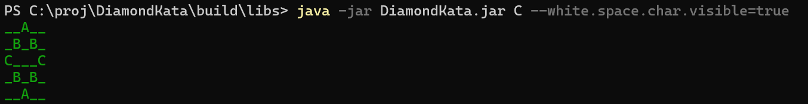
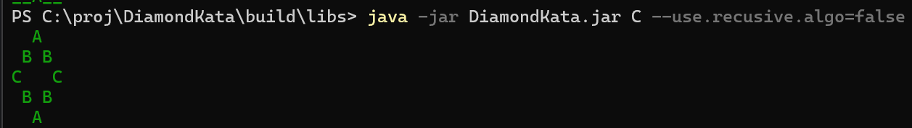

# Command Line Application for Creating a Diamond Kata based on input
## How to use
### Prerequisites: Java 21
Run a gradle build then navigate to < project location >\DiamondKata\build\libs and open this location in CMD prompt / terminal.

For single run java -jar DiamondKata.jar < input > .

For continuous run java -jar DiamondKata.jar --should.run.once=false . The terminal will then wait for user input to be typed in. You can exit this mode by typing exit, q or quit.

You can provide additional flags to run with different features: 

--should.run.once=true/false 

This toggles running in single input mode, where the input is read from args. Or Running in continuous mode which will use console input from the user.

--white.space.char.visible=true/false

This toggles whether the whitespace char is visible or not. In visible mode the whitespace char will be "_" else it uses " ".

--use.recursive.algo=true/false

This toggles the algorithm to use for Diamond Kata generation. It will use the recursive algorithm if true else it will use the linear algorithm.